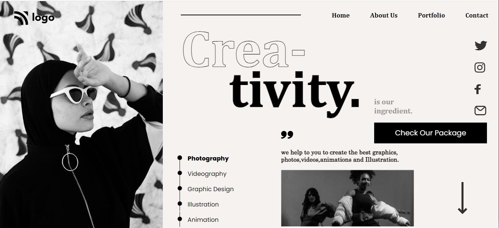

# Project 14

## Dancing Landing Page

### 🕺 A Landing Page of a Dance Studio. 💃

  

#### Built Using HTML & CSS (Desktop💻 & Phone📱 view Only)

#### Time Taken to finish the Project - 7 hours ⌛ (approx)

---

## Things learned from project -

- 
- 
- 
- 
- 

---

## Live Link [Demo](https://manas-ranjan-murmu-project14.netlify.app/)

### Screenshot

---

### Mobile View Screenshot

---
